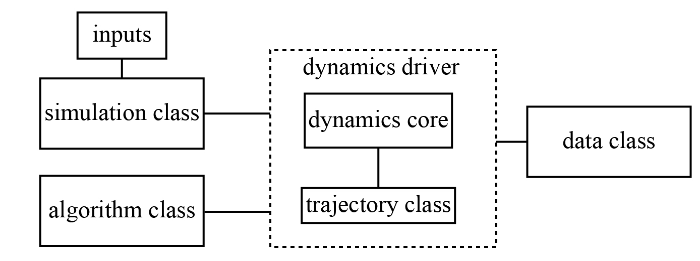

QC-lab's Architecture
=====================

QC-lab utilizes a central dynamics core for the low-level execution of dynamics algorithms. Users interact with this core primarily through two key objects:

* **Model Class:**  Provides a comprehensive description of the physical system and simulation parameters. 
* **Algorithm Class:** Defines a specific mixed quantum-classical algorithm in the form of a "recipe" comprised of a list of functions ("ingredients") that are executed in a prescribed order. Users can modify algorithms by replacing or adding ingredients to the algorithm recipe. 

To facillitate the execution of the dynamics, QC-lab comes with a variety of dynamics drivers which are optional (but recommended) functions that control the execution of the
dynamics core in several commonly used formats. In addition to the model and algorithm classes, the dynamics core is provided with a "Data" class that is used to store the simulation output.

   QC-lab Architecture. The dynamics core is interfaced with via a model class that accepts user-defined inputs and an algorithm class in the form of a recipe. It outputs data in the form of a data class. 