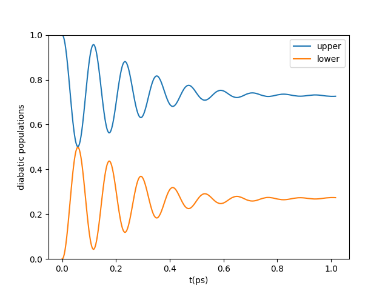
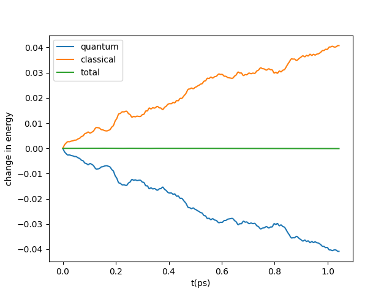
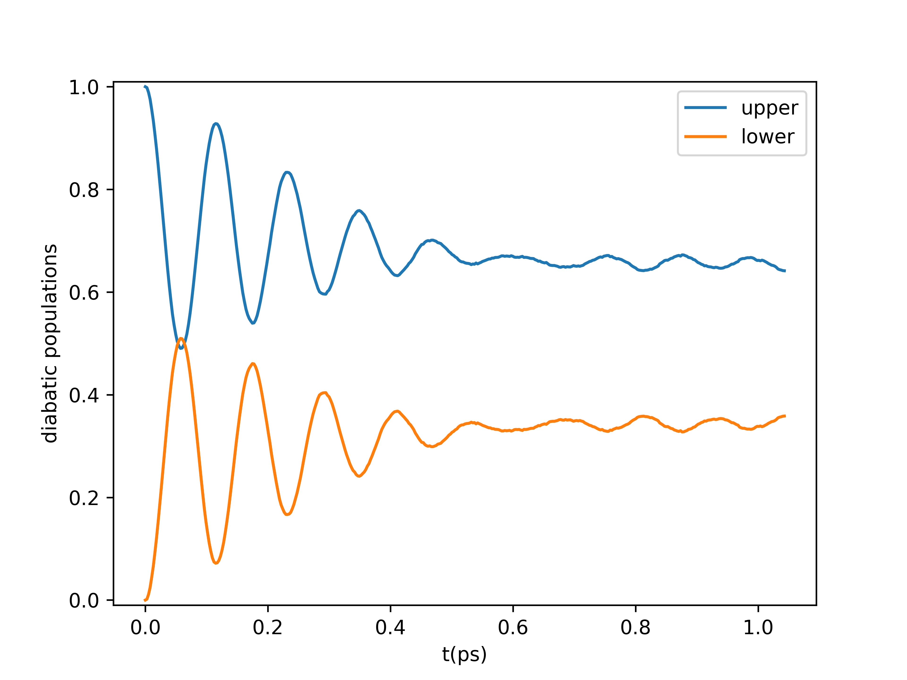
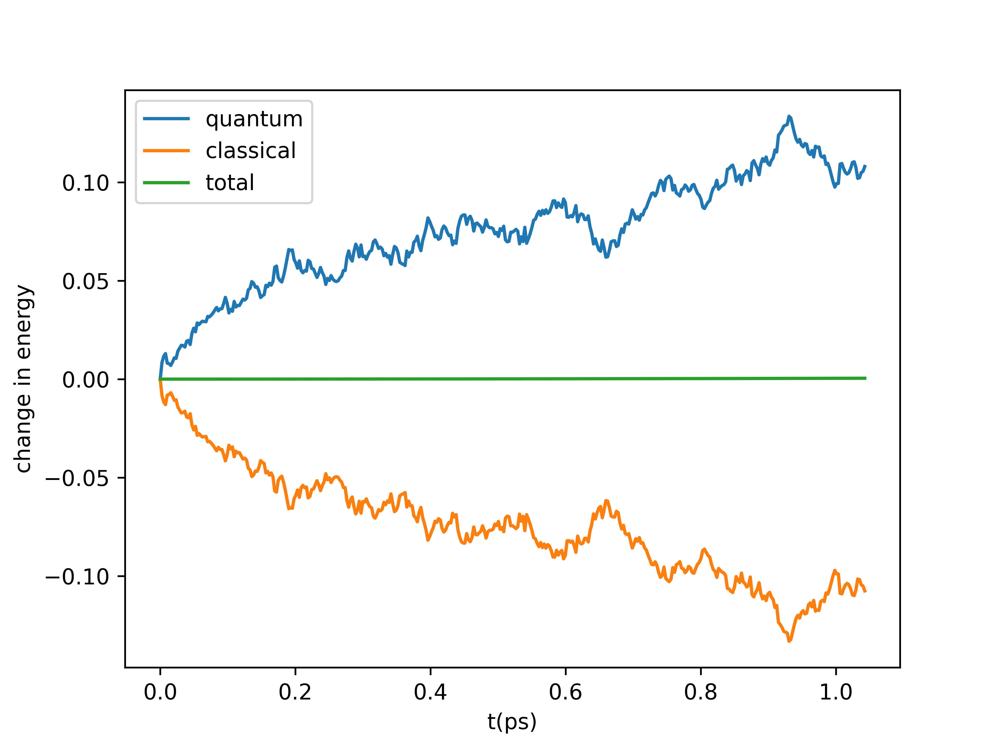
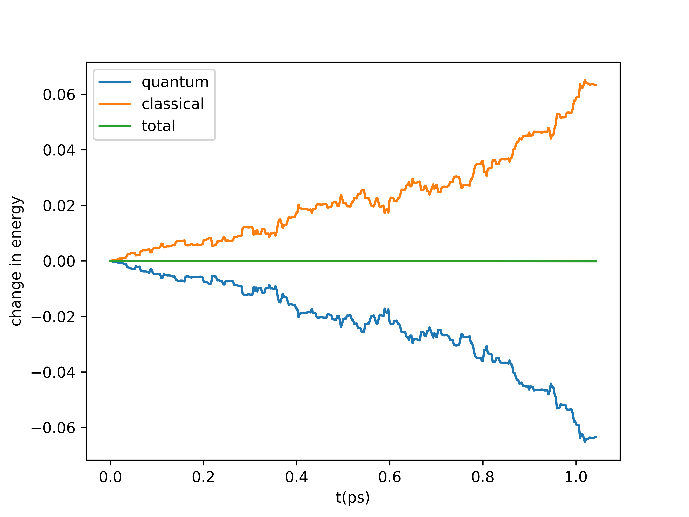

Example Calculations
====================

Some examples of using QC-lab can be found in the Jupyter notebooks in the examples directory of the project's
Github repository. 

Mean-Field Spin-Boson Model 
---------------------------

Here we will go through an example of using QC-lab to simulate a spin-boson model with mean-field dynamics.

The first step is to import the model class::

      from qclab.models.spin_boson import SpinBosonModel

Next we will initialize the model class by creating a dictionary with appropriate input parameters (these inputs are determined in the construction
of the model class and are by no means universal) that can be found in the documentation for each of the Simulation Classes that come with QC-lab::

      input_params = dict(temp = 1, V=0.5, E=0.5, A=100, W=0.1, l=0.02/4)
      model = SpinBosonModel(input_params = input_params)

Next we will attach attributes needed to run the dynamics::

      model.batch_size = 100
      model.tmax = 40
      model.dt_output = 0.1
      model.dt = 0.01

The initial quantum state in the diabatic basis can then be created. It is important to note that the ordering of diabatic basis states is 
determined in the definition of the model class.::

      import numpy as np
      sim.wf_db = np.zeros((sim.num_states), dtype=complex)
      sim.wf_db[0] = 1.0 + 0.0j

Before running the dynamics calculation we have to generate a list of seeds that will be used in the initialization and execution of each trajectory. Each seed
uniquely characterizes all random aspects of its associated trajectory and can be used to exactly reproduce the tajectory at a later time. Because we are running batches of `100` 
trajectories (as indicated by ``model.batch_size=100``) at a time in this example, the number of seeds we need must be an integer multiple of 100. If we wish to run 1000 trajectories, then we will need
that many seeds. ::

      seeds = np.arange(10*model.batch_size, dtype=int)

Now we can import and initialize the algorithm recipe::

      from qclab.recipes import MeanFieldDynamicsRecipe
      recipe = MeanFieldDynamicsRecipe(model)

Then we import a driver, in this case we will use the serial driver::
      
      from qclab.drivers.serial_driver import dynamics_serial

Now we can run the dynamics. This calculation takes about 30 seconds on a laptop with eight cores.::

      data = dynamics_serial(recipe=recipe, model = model, seeds = seeds, ncpus = 1, data = None)

Observables are stored in a dictionary inside the data class returned by the dynamics driver, ``data.data_dic``, and so we can plot the energies and populations as::

      ntraj =  num_seeds # obtain number of trajectories to normalize
      pops = np.real(np.einsum('nii->ni',data.data_dic['dm_db']))/ntraj # obtain diagonal of density matrix
      t_ps = data.data_dic['t'] * 0.0260677 /ntraj # convert time units to picoseconds
      e_q = data.data_dic['e_q']/ntraj # quantum energy
      e_c = data.data_dic['e_c']/ntraj # classical energy

      # plot diabatic populations
      plt.plot(t_ps, pops[:,0], label='upper')
      plt.plot(t_ps, pops[:,1], label='lower')
      plt.ylabel('diabatic populations')
      plt.xlabel('t(ps)')
      plt.legend()
      plt.ylim([-0.01,1.01])
      plt.show()

      # plot change in energy
      plt.plot(t_ps, np.real(e_q - e_q[0]), label='quantum')
      plt.plot(t_ps, np.real(e_c - e_c[0]), label='classical')
      plt.plot(t_ps, np.real(e_c - e_c[0] + e_q - e_q[0]), label='total')
      plt.ylabel('change in energy')
      plt.xlabel('t(ps)')
      plt.legend()
      plt.show()

The resulting plots are 

The complete code is::

      from qclab.models.spin_boson import SpinBosonModel

      input_params = dict(temp = 1, V=0.5, E=0.5, A=100, W=0.1, l_reorg=0.02/4)
      model = SpinBosonModel(input_params = input_params)

      model.batch_size = 100
      model.tmax = 40
      model.dt_output = 0.1
      model.dt = 0.01

      import numpy as np
      model.wf_db = np.zeros((model.num_states), dtype=complex)
      model.wf_db[0] = 1.0 + 0.0j

      seeds = np.arange(10*model.batch_size, dtype=int)

      from qclab.recipes import MeanFieldDynamicsRecipe
      recipe = MeanFieldDynamicsRecipe(model)
      recipe.params.dt = 0.01 
      

      from qclab.drivers.serial_driver import dynamics_serial

      data = dynamics_serial(recipe=recipe, model = model, seeds = seeds, ncpus = 1, data = None)

      ntraj =  len(data.seed_list) # obtain number of trajectories to normalize
      pops = np.real(np.einsum('nii->ni',data.data_dic['dm_db']))/ntraj # obtain diagonal of density matrix
      t_ps = data.data_dic['t'] * 0.0260677 /ntraj # convert time units to picoseconds
      e_q = data.data_dic['e_q']/ntraj # quantum energy
      e_c = data.data_dic['e_c']/ntraj # classical energy

      # plot diabatic populations
      import matplotlib.pyplot as plt
      plt.plot(t_ps, pops[:,0], label='upper')
      plt.plot(t_ps, pops[:,1], label='lower')
      plt.ylabel('diabatic populations')
      plt.xlabel('t(ps)')
      plt.legend()
      plt.ylim([-0.01,1.01])
      plt.show()

      # plot change in energy
      plt.plot(t_ps, np.real(e_q - e_q[0]), label='quantum')
      plt.plot(t_ps, np.real(e_c - e_c[0]), label='classical')
      plt.plot(t_ps, np.real(e_c - e_c[0] + e_q - e_q[0]), label='total')
      plt.ylabel('change in energy')
      plt.xlabel('t(ps)')
      plt.legend()
      plt.show()

FSSH Spin-Boson Model 
---------------------

To demonstrate the versatility of QC-lab, let's now apply the fewest-switches surface hopping algorithm to the same spin-boson model class. 
All we have to do is import the relevant recipe and run the dynamics again! This calculation takes just under three minutes on a cpu with eight cores. ::

      from qclab.recipes import FewestSwitchesSurfaceHoppingRecipe
      recipe = FewestSwitchesSurfaceHoppingRecipe(model)

      data = dynamics_serial(recipe=recipe, model = model, seeds = seeds, ncpus=1, data = None)

Now we can use the same code as above to generate the following plots: 

CFSSH Spin-Boson Model 
----------------------

It is now straight forward to do the same for the CFSSH algorithm, ::

      from qclab.recipes import CoherentFewestSwitchesSurfaceHoppingRecipe
      recipe = CoherentFewestSwitchesSurfaceHoppingRecipe(model)

      data = dynamics_serial(recipe=recipe, model = model, seeds = seeds, ncpus=1, data = None)

Yielding the following plots: 

Useful Tips
-----------

* To add additional trajectories to an existing data object, simply feed the data object and a new set of seeds into the dynamics driver. ::

      new_seeds = data.seed_list + len(data.seed_list) # increment seeds up 
      data = dynamics_serial(recipe=recipe, model = model, seeds = new_seeds, ncpus=1, data = data)

