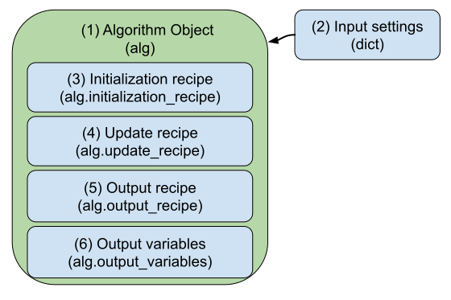

.. _algorithm:

The Algorithm Object
========================

The **Algorithm Object** defines the quantum-classical dynamics algorithm that will be used to simulate the system of interest.
In the analogy of preparing a dish, the algorithm object provides the "recipe" that guides dynamics simulation.

In this page we will explore the elements that make up an algorithm object. 
For a detailed discussion of algorithm develoment, see the `Algorithm Development <../../user_guide/algorithm_dev.html>`_ page.

1. **Algorithm Object**: The algorithm object is an instance of the `Algorithm` class from `qc_lab`.

2. **Input Settings**: The input settings is a dictionary of high-level settings that govern the behavior of the algorithm. 
   Note that these are distinct from the settings of the simulation like the timestep, number of trajectories, etc.
   Instead, the algorithm settings are specific to individual algorithms, for example the sampling protocol of FSSH. Mean-Field dynamics, however, does not require any input settings.

3. **Initialization Recipe**: The initialization recipe is a list of tasks (functions) that are executed at the outset of a simulation, ie at the zeroth timestep. Unlike the ingredients of a model, the recipes of an algorithm
   are not named lists, but instead just ordered lists of tasks. The ordering of the tasks is important, as the tasks are executed in the order they are defined. 

4. **Update Recipe**: The update recipe is a list of tasks that are executed at each timestep of the simulation. These typically define the propagation of the quantum and classical degrees of freedom, 
   as well as any other updates that need to be performed at each timestep. 
   Like the initialization recipe, the update recipe is an ordered list of tasks that are executed in the order they are defined.

5. **Output Recipe**: The output recipe is a list of tasks that are executed at every output timestep of the simulation. Typically this is some multiple of the propagation timestep and is used to sample observables
   at a coarser time resolution than the propagation timestep. 
   The output recipe is also an ordered list of tasks that are executed in the order they are defined.   

6. **Output Variables**: In order to collect particular quantities, the algorithm object defines a list of output variables that are collected at each output timestep. 
   These variables are defined as strings that correspond to attributes of the internal state object.

.. button-link:: tasks.html
    :color: primary
    :shadow:
    :align: center

    I want to learn how a task works.