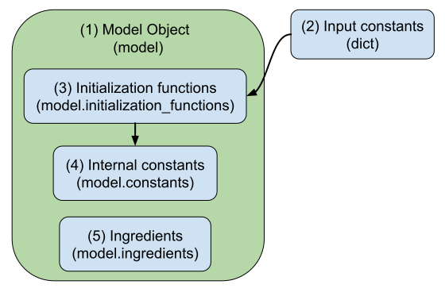

.. _model:

The Model Object
========================

The **Model Object** encapsulates the physical properties of a system of interest.
In its essence, it defines the quantum-classical Hamiltonian that gives rise to the dynamics of the system.

In this page we will explore the components of the model object without going into precise details about the impelemntation
of a specific model. For a detailed discussion of model develoment, see the `Model Development <../../user_guide/model_dev.html>`_ page.

1. **Model Object**: The model object is an instance of the `Model` class from `qc_lab`. 
2. **Input Constants**: The input constants are high level parameters that govern the behavior of the model 
   like the number of sites in a lattice, the characteristic frequency of a spectral density, or other quantities the user may want to specify.
3. **Initialization Functions**: The initialization functions are a list of functions that converts the user-speficied input constants into 
   internal constants that are used both by QC Lab and any ingredients defined by the user in the model object. 
4. **Internal Constants**: Internal constants are quantities that are derived from the input constants and have a well-defined meaning and structure 
   within the context of the model and QC Lab. In the following table we list the necessary internal constants required by QC Lab, as well as their structure. 
5. **Ingredients**: The model ingredients are functions that define the specific properties of the Model. At its most basic, these ingredients define the 
   quantum, quantum-classical, and classical terms of the Hamiltonian. Because QC Lab expects these ingredients to be attached to specific attributes of 
   the model object, they are defined in a list of tuples, where each tuple contains the name of the attribute and the function that defines the ingredient. 
   For example, the quantum Hamiltonian ingredient accessed at `model.h_q` would be defined by the ingredients list `model.ingredients = [('h_q', h_q_function)]`.

.. list-table:: QC Lab Internal Constants
   :header-rows: 1
   :widths: 20 20 20
 
   * - Name
     - Structure
     - Description
   * - `model.constants.num_quantum_states`
     - int
     - The dimension of the quantum Hilbert space, i.e., the number of quantum states in the model.
   * - `model.constants.num_classical_coordinates`
     - int
     - The total number of classical coordinates in the mode.
   * - `model.constants.classical_coordinate_mass`
     - numpy.ndarray(model.constants.num_classical_coordinates, dtype=float)
     - The mass of each classical coordinate in the model.
   * - `model.constants.classical_coordinate_weight`
     - numpy.ndarray(model.constants.num_classical_coordinates, dtype=float)
     - The weight of each classical coordinate in the model, corresponding to the `h` parameter in `Miyazaki et. al. (2024) <https://doi.org/10.1021/acs.jctc.4c00555>`_.

Combining these elements provides a bare bones model object that can be used in a quantum-classical simulation.

.. code-block:: python

    from qc_lab import Model

    class MyModel(Model):
        def __init__(self, constants={}):
            default_constants = {
                'N': 10,
                'mass': 1,
                'A': 10,
                'h': 1.0,
            }   
            super().__init__(self.default_constants, constants)

        def initialize_internal_constants(self):
            self.constants.num_quantum_states = self.constants.N
            self.constants.num_classical_coordinates = self.constants.A
            self.constants.classical_coordinate_mass = \
                np.ones(self.constants.num_classical_coordinates) * self.constants.mass
            self.constants.classical_coordinate_weight = \
                np.ones(self.constants.num_classical_coordinates) * self.constants.h
        
        initialization_functions = [
            initialize_internal_constants,
        ]

        def h_q_function(self, state):
            # Define the quantum Hamiltonian here
            pass

        def h_c_function(self, state):
            # Define the classical Hamiltonian here
            pass    

        def h_qc_function(self, state):
            # Define the quantum-classical Hamiltonian here
            pass    

        ingredients = [
            ('h_q', h_q_function),
            ('h_c', h_c_function),
            ('h_qc', h_qc_function),
        ]

