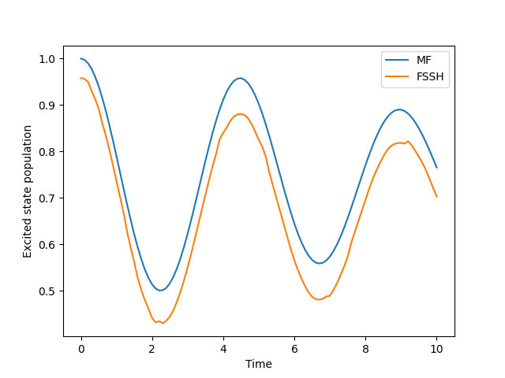

.. _change-algorithm:

I want to use FSSH instead.
===========================

Sure, following the last example you can just swap out `sim.algorithm` to use `FewestSwitchesSurfaceHopping`.
Assuming you ran the previous example code we can just reuse the same simulation object.

.. code-block:: python

    from qc_lab.algorithms import FewestSwitchesSurfaceHopping

    sim.algorithm = FewestSwitchesSurfaceHopping()
    data_fssh = serial_driver(sim)

Now the results look a bit different.

.. code-block:: python

    plt.plot(data.data_dict["t"], np.real(data.data_dict["dm_db"][:,0,0]), label='MF')
    plt.plot(data_fssh.data_dict["t"], np.real(data_fssh.data_dict["dm_db"][:,0,0]), label='FSSH')
    plt.xlabel('Time')
    plt.ylabel('Excited state population')
    plt.legend()
    plt.show()

You can learn about other algorithms in the `Algorithms documentation <../../user_guide/algorithms/algorithms.html>`_.

.. note::

    The populations above are not in agreement at the outset of the simulation because the FSSH algorithm 
    stochastically samples the initial state while the MF algorithm does not. If the number of trajectories 
    were increased, the populations would converge to the same value as the `MeanField` algorithm at the outset of the simulation.

.. comment::

    .. button-ref:: simulation-settings
        :color: primary
        :shadow:
        :align: center

        I want to run more trajectories.