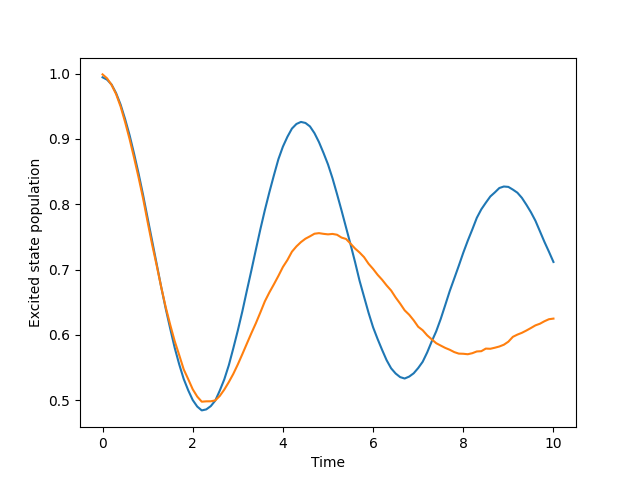

.. _change-algorithm:

I want to use FSSH instead.
===========================

Sure! Following the last example you can simply swap out `sim.algorithm` to use `FewestSwitchesSurfaceHopping`.

.. code-block:: python

    from qc_lab.algorithms import FewestSwitchesSurfaceHopping

    sim.algorithm = FewestSwitchesSurfaceHopping()

The output has changed once more:

You can learn about algorithms in the `Algorithms documentation <../../user_guide/algorithms/algorithms.html>`_.

.. note::

    The populations above are not in agreement at the outset of the simulation because the FSSH algorithm 
    stochastically samples the initial state while the mean-field algorithm does not. If the number of trajectories 
    were increased, the initial populations would converge to the same value.
