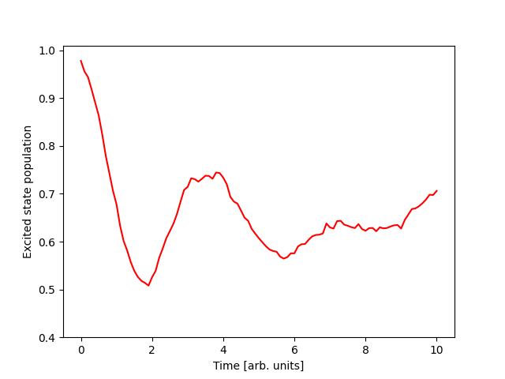

.. _full-example:

Putting it all together.
==========================

This is what the final code looks like:

.. code-block:: python

    import numpy as np
    import matplotlib.pyplot as plt
    from qclab import Simulation
    from qclab.models import SpinBoson
    from qclab.algorithms import FewestSwitchesSurfaceHopping
    from qclab.dynamics import serial_driver
    from qclab.functions import vectorize_ingredient

    def update_z_reverse_frustrated_fssh(sim, state, parameters):
        """
        Reverse the velocities of frustrated trajectories in the FSSH algorithm.
        """
        # Get the indices of trajectories that were frustrated
        # (i.e., did not successfully hop but were eligible to hop).
        frustrated_indices = state.hop_ind[~state.hop_successful]
        # Reverse the velocities for these indices, in the complex classical coordinate 
        # formalism, this means conjugating the z coordinate.
        state.z[frustrated_indices] = state.z[frustrated_indices].conj()
        return state, parameters

    @vectorize_ingredient
    def h_qc(model, parameters, **kwargs):
        """
        A coupling term that couples the boson coordinates to the off-diagonal elements of the quantum Hamiltonian.
        """
        # First we'll get the z coordinate from the keyword arguments
        z = kwargs['z']
        # Next we'll get the Required constants from the constants object.
        m = model.constants.classical_coordinate_mass
        h = model.constants.classical_coordinate_weight
        g = model.constants.harmonic_frequency * np.sqrt(2 * model.constants.l_reorg / model.constants.A)
        # Now we can construct the empty Hamiltonian matrix as a 2x2 complex array.
        h_qc = np.zeros((2, 2), dtype=complex)
        # Then we can populate the off-diagonal elements of the Hamiltonian matrix.
        h_qc[0, 1] = np.sum((g * np.sqrt(1 / (2 * m * h))) * (z + np.conj(z)))
        h_qc[1, 0] = np.conj(h_qc[0, 1])
        return h_qc

    # Initialize the simulation object.
    sim = Simulation()
    # Equip it with a spin-boson model object.
    sim.model = SpinBoson()
    # Change the reorganization energy.
    sim.model.constants.l_reorg = 0.05
    # Add the new coupling term to the model's ingredients.
    sim.model.ingredients.append(("h_qc", h_qc))
    # Overwrite the analytical gradient ingredient, which is no longer correct for the new coupling.
    sim.model.ingredients.append(("dh_qc_dzc", None))
    # Attach the FSSH algorithm.
    sim.algorithm = FewestSwitchesSurfaceHopping()
    # Insert the function for reversing velocities as a task into the update recipe.
    sim.algorithm.update_recipe.append(update_z_reverse_frustrated_fssh)
    # Initialize the diabatic wavevector. 
    # Here, the first vector element refers to the upper state and the second
    # element refers to the lower state.
    sim.initial_state.wf_db = np.array([1, 0], dtype=complex)

    # Run the simulation.
    data = serial_driver(sim)

    # Pull out the time.
    t = data.data_dict["t"]
    # Get populations from the diagonal of the density matrix.
    populations = np.real(np.einsum("tii->ti", data.data_dict["dm_db"]))
    plt.plot(t, populations[:, 0], color="red")
    plt.xlabel('Time [arb. units]')
    plt.ylabel('Excited state population')
    plt.ylim([0.4,1.01])
    plt.legend(frameon=False)
    plt.savefig("full_code_output.png")
    plt.show()

