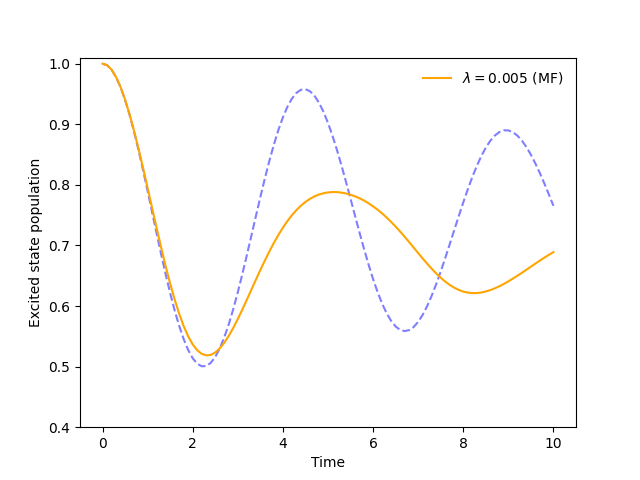

.. _model-constants:

I want to change the reorganization energy.
===========================================

Changing the reorganization energy is easy! 

Using the same simulation object from the previous example, we can modify the `l_reorg` constant in `sim.model.constants`.

.. code-block:: python

    sim.model.constants.l_reorg = 0.05

The output changes to (dash shows previous result):

For a complete list of model constants and their descriptions, please refer to the `Spin-Boson Model documentation <../../user_guide/models/spin_boson_model.html>`_.

