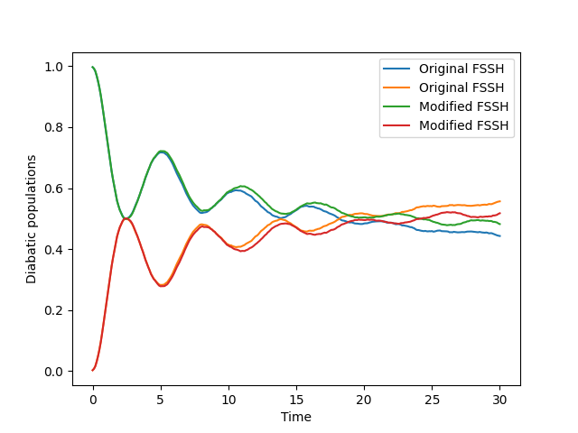

.. _modify-fssh:

Modifying the FSSH Algorithm
============================

Let's try modifying the FSSH algorithm so that the directions of the velocities of frustrated trajectories are reversed.
In the complex coordinate formalism, this means conjugating the z coordinate of the frustrated trajectories.

.. code-block:: python

    def update_z_reverse_frustrated_fssh(algorithm, sim, parameters, state):
        """
        Reverse the velocities of frustrated trajectories in the FSSH algorithm.
        """
        # get the indices of trajectories that were frustrated
        # (i.e., did not successfully hop but were eligible to hop)
        frustrated_indices = state.hop_ind[~state.hop_successful]
        # reverse the velocities for these indices, in the complex calssical coordinate 
        # formalism, this means conjugating the z coordiante.
        state.z[frustrated_indices] = state.z[frustrated_indices].conj()
        return parameters, state

Now we can insert this task into an instance of the FSSH algorithm object. To know where we should insert it, we can look 
at the `update_recipe` attribute of the FSSH algorithm object.

.. code-block:: python

    from qc_lab.algorithms import FSSH

    # Create an instance of the FSSH algorithm
    fssh_algorithm = FSSH()

    # Print the update recipe to see where to insert our task
    for ind, task in enumerate(fssh_algorithm.update_recipe):
        print(f"Task #{ind}", task)

An example output from the above code might look like this:

.. code-block:: text

    Task #0 <function FewestSwitchesSurfaceHopping._assign_eigvecs_to_state at 0x777d902d2710>
    Task #1 <function FewestSwitchesSurfaceHopping._update_z_rk4 at 0x777d902d28c0>
    Task #2 <function FewestSwitchesSurfaceHopping._update_wf_db_eigs at 0x777d902d2950>
    Task #3 <function FewestSwitchesSurfaceHopping._update_h_quantum at 0x777d902d2560>
    Task #4 <function FewestSwitchesSurfaceHopping._diagonalize_matrix at 0x777d902d25f0>
    Task #5 <function FewestSwitchesSurfaceHopping._gauge_fix_eigs_update at 0x777d902d29e0>
    Task #6 <function update_hop_probs_fssh at 0x777d902d13f0>
    Task #7 <function update_hop_inds_fssh at 0x777d902d1480>
    Task #8 <function update_hop_vals_fssh at 0x777d902d1510>
    Task #9 <function update_z_hop_fssh at 0x777d902d15a0>
    Task #10 <function update_act_surf_hop_fssh at 0x777d902d1630>
    Task #11 <function update_act_surf_wf at 0x777d902d0e50>

A good place to invert the velocities of frustrated trajectories is after the `update_z_hop_fssh` task, which updates the z coordinates after a hop.
QC Lab makes this particularly easy to do by using python's built-in list methods to insert out new task into the correct position.

.. code-block:: python

    # Insert the new task into the update recipe
    fssh_algorithm.update_recipe.insert(10, update_z_reverse_frustrated_fssh)
    # Now we can verify we put it in the right place by printing the update recipe again
    for ind, task in enumerate(fssh_algorithm.update_recipe):
        print(f"Task #{ind}", task)

This yields the following output showing that our new task has been inserted at the correct position in the update recipe:

.. code-block:: text

    Task #0 <function FewestSwitchesSurfaceHopping._assign_eigvecs_to_state at 0x777d902d2710>
    Task #1 <function FewestSwitchesSurfaceHopping._update_z_rk4 at 0x777d902d28c0>
    Task #2 <function FewestSwitchesSurfaceHopping._update_wf_db_eigs at 0x777d902d2950>
    Task #3 <function FewestSwitchesSurfaceHopping._update_h_quantum at 0x777d902d2560>
    Task #4 <function FewestSwitchesSurfaceHopping._diagonalize_matrix at 0x777d902d25f0>
    Task #5 <function FewestSwitchesSurfaceHopping._gauge_fix_eigs_update at 0x777d902d29e0>
    Task #6 <function update_hop_probs_fssh at 0x777d902d13f0>
    Task #7 <function update_hop_inds_fssh at 0x777d902d1480>
    Task #8 <function update_hop_vals_fssh at 0x777d902d1510>
    Task #9 <function update_z_hop_fssh at 0x777d902d15a0>
    Task #10 <function update_z_reverse_frustrated_fssh at 0x777d580da200>
    Task #11 <function update_act_surf_hop_fssh at 0x777d902d1630>
    Task #12 <function update_act_surf_wf at 0x777d902d0e50>

Now we can easily compare the results of the modified FSSH algorithm with the original one.

.. code-block:: python

    from qc_lab import Simulation # import simulation class 
    from qc_lab.models import SpinBoson # import model class 
    from qc_lab.dynamics import parallel_driver_multiprocessing

    # Create an instance of the original FSSH algorithm
    original_fssh_algorithm = FewestSwitchesSurfaceHopping()

    sim = Simulation()

    sim.settings.num_trajs = 4000
    sim.settings.batch_size = 1000
    sim.settings.tmax = 30
    sim.settings.dt_update = 0.01

    sim.model = SpinBoson({
        'V':0.5,
        'E':0.5,
        'A':100,
        'W':0.1,
        'l_reorg':0.1,
        'boson_mass':1.0,
        'kBT':1.0,

    })
    sim.state.wf_db= np.array([1,0], dtype=complex)
    # Run the simulation with the original FSSH algorithm
    sim.algorithm = original_fssh_algorithm
    data_original = parallel_driver_multiprocessing(sim)

    # Now run the simulation with the modified FSSH algorithm
    sim.algorithm = fssh_algorithm
    data_modified = parallel_driver_multiprocessing(sim)

    t_original = data_original.data_dict['t']
    pops_original = np.real(np.einsum('tii->ti',data_original.data_dict['dm_db']))
    t_modified = data_modified.data_dict['t']
    pops_modified = np.real(np.einsum('tii->ti',data_modified.data_dict['dm_db']))
    plt.plot(t_original, pops_original, label='Original FSSH')
    plt.plot(t_modified, pops_modified, label='Modified FSSH')
    plt.xlabel('Time')
    plt.ylabel('Diabatic populations')
    plt.legend()
    plt.savefig('modified_fssh_populations.png')
    plt.show()

This code runs the simulation with both the original and modified FSSH algorithms, and then plots the diabatic populations over time for comparison. Note that the
timestep chosen may need to be adjusted to ensure convergence. 

