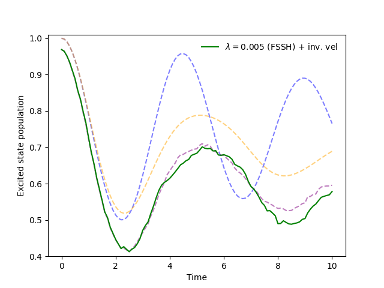

.. _modify-fssh:

Modifying the FSSH Algorithm
============================

Let's try modifying the FSSH algorithm so that the directions of the velocities of frustrated trajectories are reversed.
In the `complex coordinate formalism <https://doi.org/10.1021/acs.jctc.4c00555>`_, this means conjugating the `z` coordinate of the frustrated trajectories.
To this end, we write the following function:

.. code-block:: python

    def update_z_reverse_frustrated_fssh(sim, state, parameters):
        """
        Reverse the velocities of frustrated trajectories in the FSSH algorithm.
        """
        # Get the indices of trajectories that were frustrated
        # (i.e., did not successfully hop but were eligible to hop).
        frustrated_indices = state.hop_ind[~state.hop_successful]
        # Reverse the velocities for these indices, in the complex classical coordinate 
        # formalism, this means conjugating the z coordinate.
        state.z[frustrated_indices] = state.z[frustrated_indices].conj()
        return state, parameters

Now we can insert this function as a task into an instance of the FSSH algorithm object. To know where we should insert it, we can look 
at the ``update_recipe`` of the FSSH algorithm object (see :ref:`fssh_source`).

A good place to invert the velocities of frustrated trajectories is just at the end of the active surface updates.
QC Lab makes this particularly easy to do by using Python's built-in list methods to append our new task to the end of the update recipe.

.. code-block:: python

    # Insert the function for reversing velocities as a task into the update recipe.
    sim.algorithm.update_recipe.append(update_z_reverse_frustrated_fssh)

The output has now changed to:

