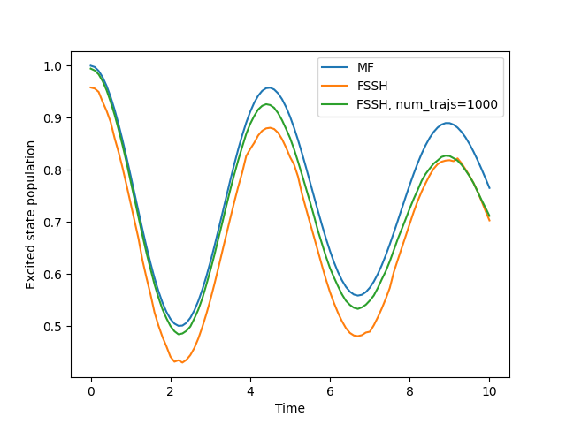

.. _simulation-settings:

I want to run more trajectories.
================================

Increasing the number of trajectories is easy! Just modify the `num_trajs` variable in `sim.settings` before running the simulation.

.. code-block:: python

    sim.settings.num_trajs = 1000
    # you can also change the batch size if you want to run more trajectories in each batch.
    sim.settings.batch_size = 1000
    data_fssh_1000 = serial_driver(sim)

Now we can plot the results of the simulation with the increased number of trajectories.

.. code-block:: python

    plt.plot(data.data_dict["t"], np.real(data.data_dict["dm_db"][:,0,0]), label='MF')
    plt.plot(data_fssh.data_dict["t"], np.real(data_fssh.data_dict["dm_db"][:,0,0]), label='FSSH')
    plt.plot(data_fssh_1000.data_dict["t"], np.real(data_fssh_1000.data_dict["dm_db"][:,0,0]), label='FSSH, num_trajs=1000')
    plt.xlabel('Time')
    plt.ylabel('Excited state population')
    plt.legend()
    plt.show()

.. button-ref:: parallel-driver
    :color: primary
    :shadow:
    :align: center

    I want it to run faster!
