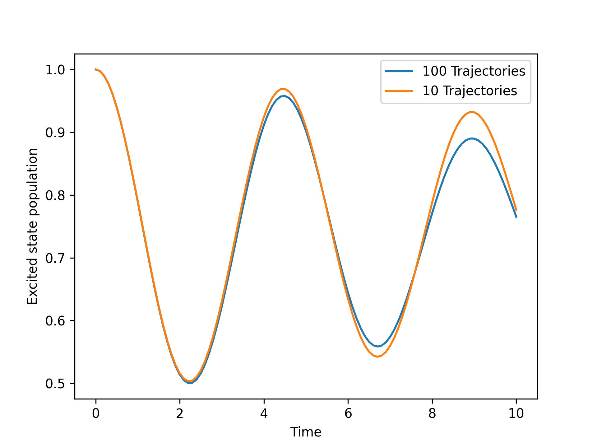

.. _simulation-settings:

Simulation settings
===================

The simulation object stores its settings in a dictionary at `Simulation.settings`.
These settings can be modified before running the simulation to customize the behavior of the simulation.
The table below lists the available settings and their default values.

.. list-table:: Simulation settings
   :widths: 20 20 60
   :header-rows: 1

   * - Setting
     - Default value
     - Description
   * - ``'dt'``
     - 0.001
     - Time step for the simulation.
   * - ``'dt_output'``
     - 0.1
     - Time step for the simulation.
   * - ``'tmax'``
     - 10
     - Maximum simulation time.
   * - ``'num_trajs'``
     - 100
     - Total number of trajectories to run.
   * - ``'batch_size'``
     - 25
     - Number of trajectories to run in each batch.

An example of changin the simulation settings is shown below, here we change the number of trajectories that the simulation runs 
and compare the resulting population dynamics. 

.. code-block:: python

    import numpy as np
    import matplotlib.pyplot as plt
    from qc_lab import Simulation
    from qc_lab.models import SpinBoson
    from qc_lab.algorithms import MeanField
    from qc_lab.dynamics import serial_driver

    # Initialize the simulation object.
    sim = Simulation()
    # Equip it with a SpinBoson model object.
    sim.model = SpinBoson()
    # Attach the MeanField algorithm.
    sim.algorithm = MeanField()
    # Initialize the diabatic wavefunction.
    sim.state.wf_db = np.array([1, 0], dtype=complex)
    # Run the simulation.
    data_100 = serial_driver(sim)
    # Change the number of trajectories.
    sim.settings.num_trajs = 10
    # Run the simulation again.
    data_10 = serial_driver(sim)
    # Plot the results.
    plt.plot(data_100.data_dict["t"], np.real(data_100.data_dict["dm_db"][:,0,0]), label='100 Trajs')
    plt.plot(data_10.data_dict["t"], np.real(data_10.data_dict["dm_db"][:,0,0]), label='10 Trajs')
    plt.xlabel('Time')
    plt.ylabel('Excited state population')
    plt.legend()
    plt.show()

