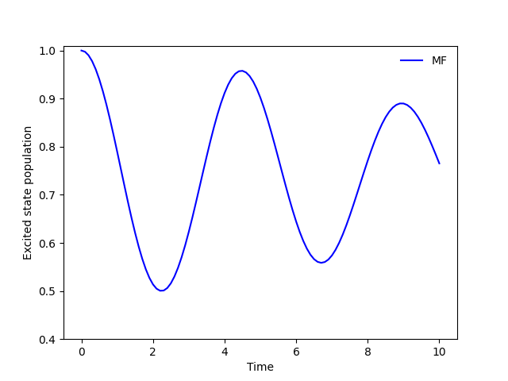

.. _spin-boson:

===========================
Running a Spin-Boson Model
===========================

Here's a simple example of how to run a spin-boson model with mean-field dynamics in QC Lab.

First, we will need to import the necessary modules:

.. code-block:: python

    import numpy as np
    import matplotlib.pyplot as plt
    from qc_lab import Simulation
    from qc_lab.models import SpinBoson
    from qc_lab.algorithms import MeanField
    from qc_lab.dynamics import serial_driver

Next, we will set up the simulation object and equip it with the model and algorithm objects:

.. code-block:: python

    # Initialize the simulation object.
    sim = Simulation()
    # Equip it with a spin-boson model object.
    sim.model = SpinBoson()
    # Attach the mean-field algorithm.
    sim.algorithm = MeanField()
    # Initialize the diabatic wavevector. 
    # Here, the first vector element refers to the upper state and the second
    # element refers to the lower state.
    sim.state.wf_db = np.array([1, 0], dtype=complex)
    

This is bound to run the spin-boson model using default values for the model constants. 
Following the definitions from `Tempelaar & Reichman 2019 <https://doi.org/10.1063/1.5000843>`_, the model constant 
values are `kBT=1.0`, `E=0.5`, `V=0.5`, `A=100`, `W=0.1`, and `l_reorg=0.005`.
Finally, we can run the simulation and visualize the results:

.. code-block:: python

    # Run the simulation.
    data = serial_driver(sim)
   
    # Pull out the time.
    t = data.data_dict["t"]
    # Get populations from the diagonal of the density matrix.
    populations = np.real(np.einsum("tii->ti", data.data_dict["dm_db"]))
    plt.plot(t, populations[:, 0], color="blue")
    plt.xlabel('Time [arb. units]')
    plt.ylabel('Excited state population')
    plt.ylim([0.4,1.01])
    plt.show()

    
The output of this code is:

    

.. note::
    This simulation ran in serial mode. For a speed-up at high-perofrmance architecture, consider adopting the parallel driver by 
    running the simulation as `data = parallel_driver_multiprocessing(sim)` instead.

I want to increase the reorganization energy.
^^^^^^^^^^^^^^^^^^^^^^^^^^^^^^^^^^^^^^^^^^^^^^

.. container:: toggle

    .. include:: model-constants.rst

I want to use FSSH instead.
^^^^^^^^^^^^^^^^^^^^^^^^^^^

.. container:: toggle

    .. include:: change-algorithm.rst

I want to reverse velocities upon frustrated hops.
^^^^^^^^^^^^^^^^^^^^^^^^^^^^^^^^^^^^^^^^^^^^^^^^^

.. container:: toggle

    .. include:: modify-fssh.rst

I want to use a different coupling term.
^^^^^^^^^^^^^^^^^^^^^^^^^^^^^^^^^^^^^^

.. container:: toggle

    .. include:: change-coupling.rst    

Putting it all together.
^^^^^^^^^^^^^^^^^^^^^^^^^^^^^^

.. container:: toggle

    .. include:: full-example.rst