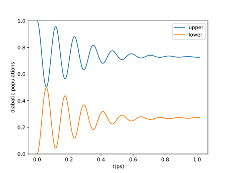
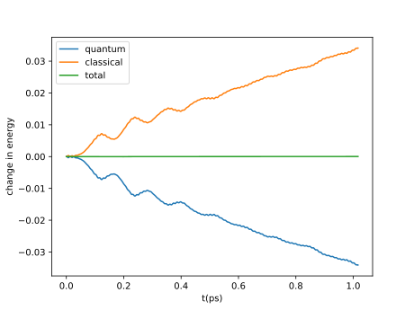

Getting Started with qc_lab
===========================

Installing qc_lab
-----------------

qc_lab can be installed with pip::

   pip install qc_lab

or from source by downloading the github repository and executing::

   pip install -e ./

from inside its topmost directory. 

qc_lab's Dynamics Core
----------------------

qc_lab utilizes a central dynamics core for the low-level execution of dynamics algorithms. Users interact with this core primarily through two key objects:

* **Simulation Class:**  Provides a comprehensive description of the physical system, simulation parameters, and observables to be calculated. Users typically create or modify existing simulation classes to model new physical systems.
* **Algorithm Class:** Defines a specific mixed quantum-classical algorithm. While most users won't modify these classes, advanced users can tailor or create algorithms by following the prescribed structure.

Both simulation and algorithm classes posess a set of required and standardized attributes used by the dynamics core. By manipulating these attributes, users can control the underlying physics and simulation properties, or implement diverse mixed quantum-classical algorithms.

To facillitate the execution of the dynamics, qc_lab comes with a variety of dynamics drivers which are optional (but recommended) functions that control the execution of the
dynamics core. In addition to the simulation and algorithm classes, the dynamics driver must be provided with a list of seeds that uniquely specify each mixed quantum-classical 
trajectory to be executed. 

.. figure:: images/code_structure.svg
   :alt: qc_lab Code Structure Diagram
   :width: 50%
   :align: center

   qc_lab Usage Diagram. The simulation class (a) is configured with input parameters. The simulation and algorithm classes (b) are passed to a dynamics driver (c), along with a list of seeds that uniquely identify each trajectory. The dynamics driver executes the simulation and returns a data class (d) containing the calculated observables.

Example Calculations
--------------------

Some written examples of using qc_lab can be found in the Jupyter notebooks in the examples directory of the project's
Github repository. 

Mean-Field Spin-Boson Model 
~~~~~~~~~~~~~~~~~~~~~~~~~~~

Here we will go through an example of using qc_lab to simulate a spin-boson model.

The first step is to import the Simulation Class we wish to use as well as some useful libraries::

      import numpy as np
      import matplotlib.pyplot as plt   
      # import the Spin-Boson Model Simulation Class
      from qclab.models.spin_boson import SpinBosonModel
      # import the simulation module 
      import qclab.simulation as simulation

Next we will initialize the Simulation Class by creating a dictionary with appropriate input parameters (these inputs are determined in the construction
of the Simulation class and are by no means universal) that can be found in the documentation for each of the Simulation Classes that come with qc_lab::

      input_params = dict(temp = 1, V=0.5, E=0.5, A=100, W=0.1, l=0.02/4)
      sim = SpinBosonModel(input_params = input_params)

Next we will attach attributes needed to run the dynamics like the timesteps::

      sim.num_trajs = 100 # we will run 100 trajectories at a time
      sim.tmax=int(1/0.0260677)+1 # calculate for the equivalent of 1 picosecond
      sim.dt=1/(10*sim.w[-1]) # determine the propagation timestep in terms of the largest bath frequency
      sim.dt_output= 5 * sim.dt # output data ever five timesteps

The initial quantum state in the diabatic basis can then be created with the prescribed name ``wf_db``::

      sim.wf_db = np.zeros((sim.num_states), dtype=complex)
      # initialize a quantum state in the upper state
      sim.wf_db[0] = 1.0 + 0.0j

Finally we can think about what observables we would like to calculate. By default qc_lab calculates the classical energy, quantum energy, and diabatic density matrix. 
For now we will stick with these default observables but you can look at the section "Custom Observables" to learn how to add particular observables later. 

Before running the dynamics calculation we have to generate a list of seeds that will be used in the initialization and execution of each trajectory. Each seed
uniquely characterizes all random aspects of its associated trajectory and can be used to exactly reproduce the tajectory at a later time. Because we are running 100 trajectories
(as indicated by ``sim.num_trajs=100``) at a time in this example, the number of seeds we need must be an integer multiple of 100::

      num_seeds = 20*sim.num_trajs # the total number of seeds we need 
      seeds = np.arange(num_seeds) # generate the seeds

Now we can import the desired algorithm::

      # import the mean-field dynamics Algorithm Class
      from qclab.algorithms.mf import MeanFieldDynamics

And a dynamics driver, let's use the serial driver first::
      
      # import the serial driver 
      from qclab.drivers.serial_driver import dynamics_serial 

Now we can run the dynamics::

      data_spin_boson_mf = dynamics_serial(algorithm = MeanFieldDynamics, sim = sim, seeds = seeds, data = simulation.Data())

Observables are stored in a dictionary inside the Data Class returned by the dynamics driver, ``data_spin_boson_mf.data_dic``, and so we can plot the energies and populations as::

      ntraj =  num_seeds # obtain number of trajectories to normalize
      pops_mf = np.real(np.einsum('nii->ni',data_spin_boson_mf.data_dic['dm_db']))/ntraj # obtain diagonal of density matrix
      t_ps = data_spin_boson_mf.data_dic['t'] * 0.0260677 /ntraj # convert time units to picoseconds
      e_q = data_spin_boson_mf.data_dic['e_q']/ntraj # quantum energy
      e_c = data_spin_boson_mf.data_dic['e_c']/ntraj # classical energy

      # plot diabatic populations
      plt.plot(t_ps, pops_mf[:,0], label='upper')
      plt.plot(t_ps, pops_mf[:,1], label='lower')
      plt.ylabel('diabatic populations')
      plt.xlabel('t(ps)')
      plt.legend()
      plt.ylim([0,1])
      plt.show()

      # plot change in energy
      plt.plot(t_ps, e_q - e_q[0], label='quantum')
      plt.plot(t_ps, e_c - e_c[0], label='classical')
      plt.plot(t_ps, e_c - e_c[0] + e_q - e_q[0], label='total')
      plt.ylabel('change in energy')
      plt.xlabel('t(ps)')
      plt.legend()
      plt.show()

The resulting plots are 

The complete code is::

      import numpy as np
      import matplotlib.pyplot as plt   
      # import the Spin-Boson Model Simulation Class
      from qclab.models.spin_boson import SpinBosonModel
      # import the mean-field dynamics Algorithm Class
      from qclab.algorithms.mf import MeanFieldDynamics
      # import the serial driver 
      from qclab.drivers.serial_driver import dynamics_serial 
      # import the simulation module 
      import qclab.simulation as simulation

      input_params = dict(temp = 1, V=0.5, E=0.5, A=100, W=0.1, l=0.02/4)
      sim = SpinBosonModel(input_params = input_params)

      sim.num_trajs = 100 # we will run 100 trajectories at a time
      sim.tmax=int(1/0.0260677)+1 # calculate for the equivalent of 1 picosecond
      sim.dt=1/(10*sim.w[-1]) # determine the propagation timestep in terms of the largest bath frequency
      sim.dt_output= 5 * sim.dt # output data ever five timesteps

      sim.wf_db = np.zeros((sim.num_states), dtype=complex)
      # initialize a quantum state in the upper state
      sim.wf_db[0] = 1.0 + 0.0j

      num_seeds = 20*sim.num_trajs # the total number of seeds we need 
      seeds = np.arange(num_seeds) # generate the seeds

      data_spin_boson_mf = dynamics_serial(algorithm = MeanFieldDynamics, sim = sim, seeds = seeds, data=simulation.Data())

      pops_mf = np.real(np.einsum('nii->ni',data_spin_boson_mf.data_dic['dm_db'])) / num_seeds # obtain diagonal of density matrix
      t_ps = data_spin_boson_mf.data_dic['t'] * 0.0260677 / num_seeds # convert time units to picoseconds
      e_q = data_spin_boson_mf.data_dic['e_q'] / num_seeds # quantum energy
      e_c = data_spin_boson_mf.data_dic['e_c'] / num_seeds # classical energy

      # plot diabatic populations
      plt.plot(t_ps, pops_mf[:,0], label='upper')
      plt.plot(t_ps, pops_mf[:,1], label='lower')
      plt.ylabel('diabatic populations')
      plt.xlabel('t(ps)')
      plt.legend()
      plt.ylim([0,1])
      plt.show()

      # plot change in energy
      plt.plot(t_ps, e_q - e_q[0], label='quantum')
      plt.plot(t_ps, e_c - e_c[0], label='classical')
      plt.plot(t_ps, e_c - e_c[0] + e_q - e_q[0], label='total')
      plt.ylabel('change in energy')
      plt.xlabel('t(ps)')
      plt.legend()
      plt.show()

Using the Ray Parallel Driver 
~~~~~~~~~~~~~~~~~~~~~~~~~~~~~

The Ray parallel driver is suitable for cases where your machine has multiple cpus. It is not suitable in its current form for parallelization across nodes on a 
cluster, however it is in principle possible to implement such paralellization with Ray. We encourage users to implement their own drivers customized towards their 
particular computing setup. The Ray parallel driver that comes with qc_lab should be suitable for a personal machine or individual nodes on a cluster. 

Only one additional argument is needed, which specifies the number of cpus over which to parallelize::

      from qclab.drivers.ray_driver import dynamics_parallel_ray

      ncpus = 8 # for a machine with 8 processors 
      data_spin_boson_mf = dynamics_parallel_ray(algorithm = MeanFieldDynamics, sim = sim, seeds = seeds, ncpus = ncpus, data = simulation.Data())

FSSH Spin-Boson Model 
~~~~~~~~~~~~~~~~~~~~~~~~~~~

Following the mean-field spin-boson model tutorial we import the relevant libraries and change the algorithm in the dynamics driver. No other changes 
are needed unless you want to explore other formulations of the FSSH algorithm.::

      import numpy as np
      import matplotlib.pyplot as plt   
      # import the Spin-Boson Model Simulation Class
      from qclab.models.spin_boson import SpinBosonModel
      # import the FSSH dynamics Algorithm Class
      from qclab.algorithms.fssh import FewestSwitchesSurfaceHoppingDynamics
      # import the parallel driver 
      from qclab.drivers.ray_driver import dynamics_parallel_ray

      input_params = dict(temp = 1, V=0.5, E=0.5, A=100, W=0.1, l=0.02/4)
      sim = SpinBosonModel(input_params = input_params)

      sim.num_trajs = 200
      sim.tmax=int(1/0.0260677)+1
      sim.dt_output=0.01
      sim.dt=1/(10*sim.w[-1])

      sim.wf_db = np.zeros((sim.num_states),dtype=complex)
      sim.wf_db[0] = 1

      num_seeds = 100*sim.num_trajs
      seeds = np.arange(0, num_seeds)

      nprocs = 8 # for a machine with 8 processors 
      data_spin_boson_mf = dynamics_parallel_ray(algorithm = FewestSwitchesSurfaceHoppingDynamics, sim = sim, seeds = seeds, nprocs=nprocs)

Using the SLURM parallel driver 
~~~~~~~~~~~~~~~~~~~~~~~~~~~~~~~

