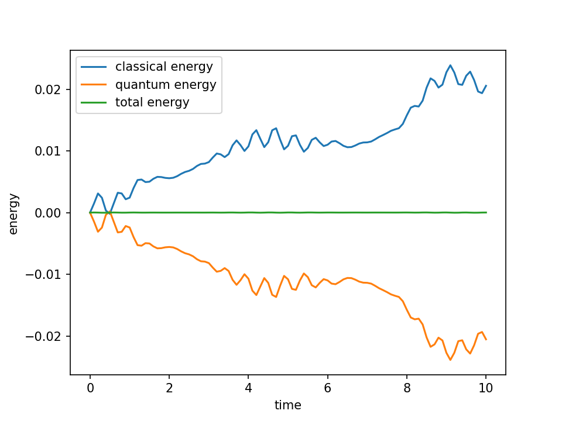

.. _spin-boson:

===========================
Running a Spin-Boson Model
===========================

This example shows how to set up and run a simple spin-boson simulation using QC Lab.

Prerequisites
-------------
- QC Lab installed (see :doc:`install`).

Overview
--------
The spin-boson model couples a two-level system (spin) to a bosonic bath. In QC Lab, we provide a `SpinBoson` model class and several algorithms.
Below we demonstrate using the `MeanField` algorithm as a minimal example.

Example: Running a Spin-Boson Simulation
----------------------------------------
Below we include the contents of the example Python script. Make sure you have a file named ``run_spin_boson.py`` in the same directory (or adjust the path accordingly).

Importing Necessary Modules
~~~~~~~~~~~~~~~~~~~~~~~~~~~
First, we import the required modules from QC Lab and other libraries:

.. literalinclude:: basic_spin_boson.py
   :language: python
   :lines: 1-6
   :caption: Importing necessary modules.

Setting Up the Simulation
~~~~~~~~~~~~~~~~~~~~~~~~~~~
Next, we initialize the simulation object and equip it with the model and algorithm objects. For convenience, we are using only the default settings and constants
for the simulation, model, and algorithm. 

.. literalinclude:: basic_spin_boson.py
   :language: python
   :lines: 9-14
   :caption: Initializing the simulation.

Setting the Initial State
~~~~~~~~~~~~~~~~~~~~~~~~~~~~~~~
Before running the simulation, we need to set the initial quantums state of the system. 
For MeanField dynamics, this is a diabatic wavefunction (`wf_db``) with dimension 2.

.. literalinclude:: basic_spin_boson.py
   :language: python
   :lines: 15-16
   :caption: Seting the initial state.

Running the Simulation
~~~~~~~~~~~~~~~~~~~~~~~~~~~~~~~
We use the `serial_driver` to run the simulation. This driver executes the dynamics in a single process and returns the results as a data object.

.. literalinclude:: basic_spin_boson.py
   :language: python
   :lines: 17-18
   :caption: Running the simulation.

Analyzing Results
~~~~~~~~~~~~~~~~~~~~~~~~~~~~~~~
After the simulation completes, we can analyze the results. By default, the MeanField algorithm class records the diabatic density matrix (`dm_db`),
the quantum and classical energies (`quantum_energy` and `classical_energy`), and the output time axis (`t`).

.. literalinclude:: basic_spin_boson.py
   :language: python
   :lines: 20-38
   :caption: Analyzing results.

.. image:: populations.png
    :alt: Population dynamics.
    :align: center
    :width: 80%

.. raw:: html

   

     <button onclick="location.href='simulation-settings.html'" style="margin: 0.5em 0; padding: 0.75em 1.5em; font-size: 1em; width: 300px; border-radius: 8px;">
       I want to change the simulation settings
     </button>
     <button onclick="location.href='model-settings.html'" style="margin: 0.5em 0; padding: 0.75em 1.5em; font-size: 1em; width: 300px; border-radius: 8px;">
       I want to change the model settings
     </button>
     <button onclick="location.href='change-model.html'" style="margin: 0.5em 0; padding: 0.75em 1.5em; font-size: 1em; width: 300px; border-radius: 8px;">
       I want to change the model
     </button>
     <button onclick="location.href='change-algorithm.html'" style="margin: 0.5em 0; padding: 0.75em 1.5em; font-size: 1em; width: 300px; border-radius: 8px;">
       I want to change the algorithm
     </button>
   
