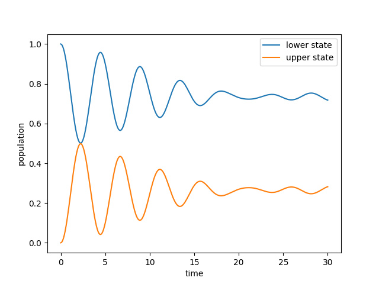
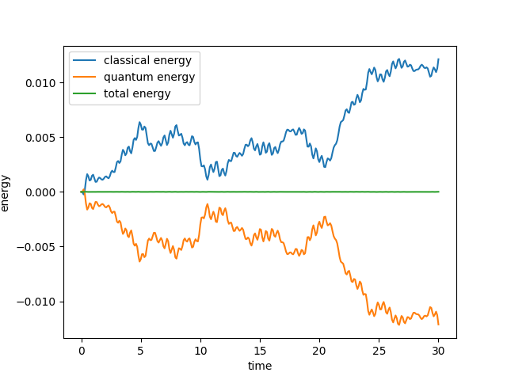
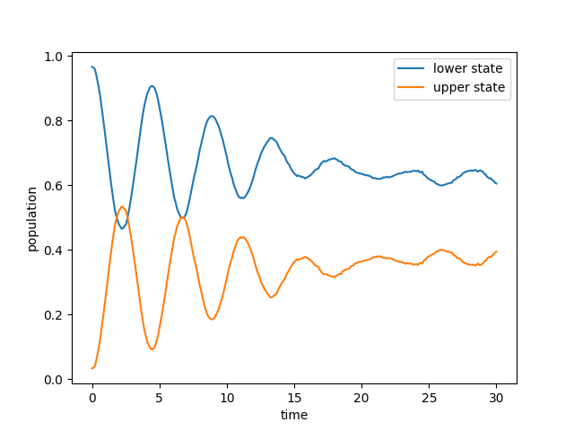
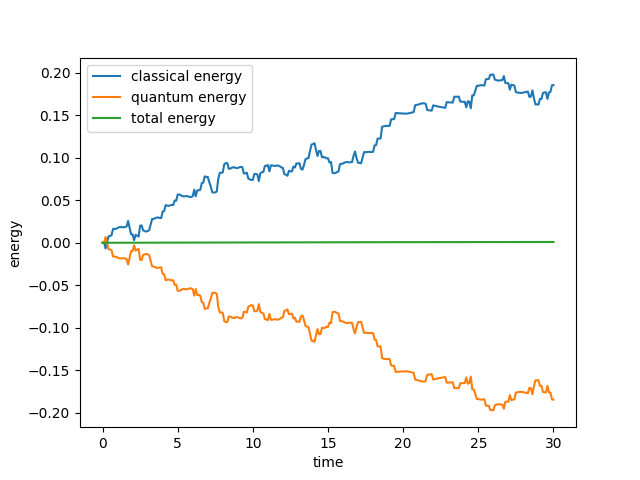

.. _quickstart:

Quick Start Guide
-----------------

QC Lab is organized into models and algorithms which are combined into a simulation object. 
The simulation object fully defines a quantum-classical dynamics simulation which is then carried out by a dynamics driver. 
This guide will walk you through the process of setting up a simulation object and running a simulation.

Importing Modules
~~~~~~~~~~~~~~~~~

First, we import the necessary modules:

.. code-block:: python

    import numpy as np
    import matplotlib.pyplot as plt
    from qc_lab import Simulation # import simulation class 
    from qc_lab.models import SpinBoson # import model class 
    from qc_lab.algorithms import MeanField # import algorithm class 
    from qc_lab.dynamics import serial_driver # import dynamics driver

Instantiating Simulation Object
~~~~~~~~~~~~~~~~~~~~~~~~~~~~~~~

Next, we instantiate a simulation object. Each object has a set of default settings which can be accessed by calling `sim.default_settings`.
Passing a dictionary to the simulation object when instantiating it will override the default settings.

.. code-block:: python

    sim = Simulation()
    print('default simulation settings: ', sim.default_settings)
    # default simulation settings:  {'tmax': 10, 'dt': 0.01, 'dt_output': 0.1, 'num_trajs': 10, 'batch_size': 1}

Alternatively, you can directly modify the simulation settings by assigning new values to the settings attribute of the simulation object. Here we change the number
of trajectories that the simulation will run, and how many trajectories are run at a time (the batch size). We also change the total time of each trajectory (tmax) and the 
timestep used for propagation (dt). Importantly, QC Lab expects that `num_trajs` is an integer multiple of `batch_size`. If not, it will use the lower integer multiple (which could be zero!).

.. code-block:: python

    # change settings to customize simulation
    sim.settings.num_trajs = 200
    sim.settings.batch_size = 50
    sim.settings.tmax = 30
    sim.settings.dt = 0.01

Instantiating Model Object
~~~~~~~~~~~~~~~~~~~~~~~~~~

Next, we instantiate a model object. Like the simulation object, it has a set of default constants. 

.. code-block:: python

    sim.model = SpinBoson()
    print('default model constants: ', sim.model.default_constants)
    # default model constants:  {'temp': 1, 'V': 0.5, 'E': 0.5, 'A': 100, 'W': 0.1, 'l_reorg': 0.005, 'boson_mass': 1}

Instantiating Algorithm Object
~~~~~~~~~~~~~~~~~~~~~~~~~~~~~~~

Next, we instantiate an algorithm object which likewise has a set of default settings. 

.. code-block:: python
    
    sim.algorithm = MeanField()
    print('default algorithm settings: ', sim.algorithm.default_settings)
    # default algorithm settings:  {}

Setting Initial State
~~~~~~~~~~~~~~~~~~~~~

Before using the dynamics driver to run the simulation, it is necessary to provide the simulation with an initial state. This initial state is
dependent on both the model and algorithm. For mean-field dynamics, we require a diabatic wavefunction called "wf_db". Because we are using a spin-boson model,
this wavefunction should have dimension 2. 

The initial state is stored in `sim.state` which can be accessed as follows,

.. code-block:: python

    sim.state.wf_db= np.array([1, 0], dtype=complex)

Running the Simulation
~~~~~~~~~~~~~~~~~~~~~~

Finally, we run the simulation using the dynamics driver. Here, we are using the serial driver. QC Lab comes with several different types of parallel drivers which are discussed elsewhere.

.. code-block:: python

    data = serial_driver(sim)

Analyzing Results
~~~~~~~~~~~~~~~~~

The data object returned by the dynamics driver contains the results of the simulation in a dictionary with keys corresponding
to the names of the observables that were requested to be recorded during the simulation.

.. code-block:: python

    print('calculated quantities:', data.data_dic.keys())
    # calculated quantities: dict_keys(['seed', 'dm_db', 'classical_energy', 'quantum_energy'])

Each of the calculated quantities must be normalized with respect to the number of trajectories. In mean-field dynamics this is equivalent 
to the number of seeds.

.. code-block:: python
    
    num_trajs = len(data.data_dic['seed'])
    classical_energy = data.data_dic['classical_energy'] / num_trajs
    quantum_energy = data.data_dic['quantum_energy'] / num_trajs
    populations = np.real(np.einsum('tii->ti', data.data_dic['dm_db'] / num_trajs))

The time axis can be retrieved from the simulation object through its settings

.. code-block:: python

    time = sim.settings.tdat_output 

Plotting Results
~~~~~~~~~~~~~~~~

Finally, we can plot the results of the simulation like the population dynamics:

.. code-block:: python

    plt.plot(time, populations[:, 0], label='upper state')
    plt.plot(time, populations[:, 1], label='lower state')
    plt.xlabel('time')
    plt.ylabel('population')
    plt.legend()
    plt.show()

We can verify that the total energy of the simulation was conserved by inspecting the change in energy of quantum and classical subsystems over time.

.. code-block:: python

    plt.plot(time, classical_energy - classical_energy[0], label='classical energy')
    plt.plot(time, quantum_energy - quantum_energy[0], label='quantum energy')
    plt.plot(time, classical_energy + quantum_energy - classical_energy[0] - quantum_energy[0], label='total energy')
    plt.xlabel('time')
    plt.ylabel('energy')
    plt.legend()
    plt.show()

Changing the Algorithm
~~~~~~~~~~~~~~~~~~~~~~

If you want to do a surface hopping calculation rather than a mean-field one, QC Lab makes it very easy to do so. 
Simply import the relevant Algorithm class and set `sim.algorithm` to it and rerun the calculation: 

.. code-block:: python

    from qc_lab.algorithms import FewestSwitchesSurfaceHopping

    sim.algorithm = FewestSwitchesSurfaceHopping()

    data = serial_driver(sim)

The populations can be visualized in a similar way as before. Note that the simulation settings chosen here are solely for testing
purposes. Publication quality simulations would require checking convergence of the number of trajectories and the timestep. 

Changing the Driver
~~~~~~~~~~~~~~~~~~~

You can likewise run the simulation using a parallel driver. Here we use the multiprocessing driver to split the trajectories 
over four tasks. An important thing to note is that when using the parallel driver, the total number of trajectories must be 
an integer multiple of the number of tasks times the batch size.

.. code-block:: python

    from qc_lab.dynamics import parallel_driver_multiprocessing

    data = parallel_driver_multiprocessing(sim, num_tasks=4)